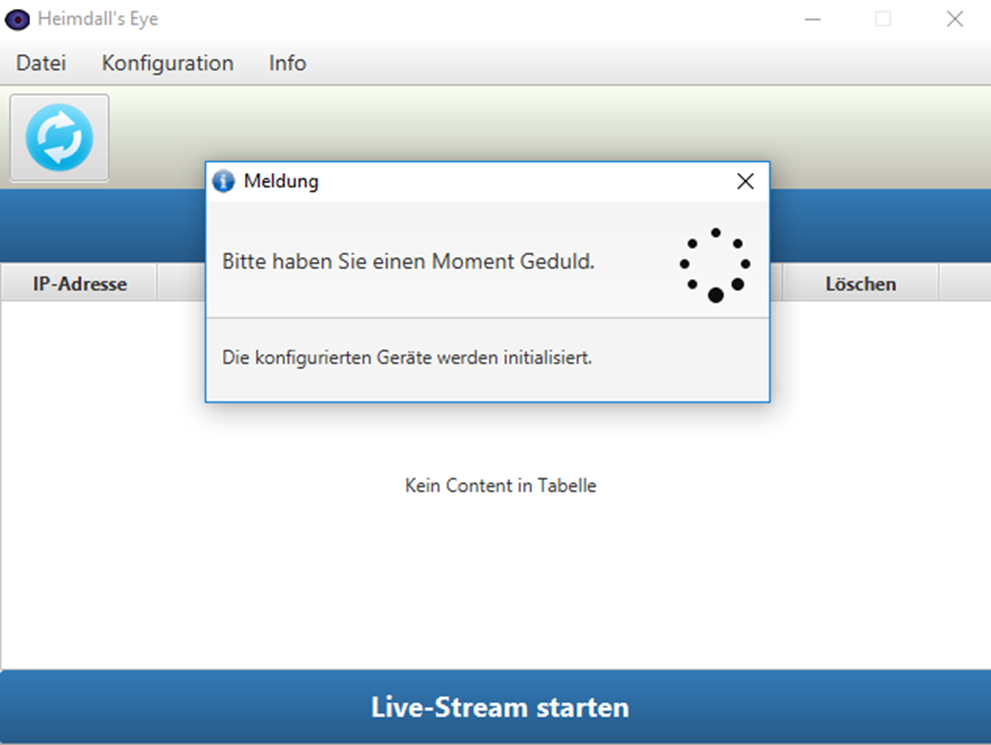
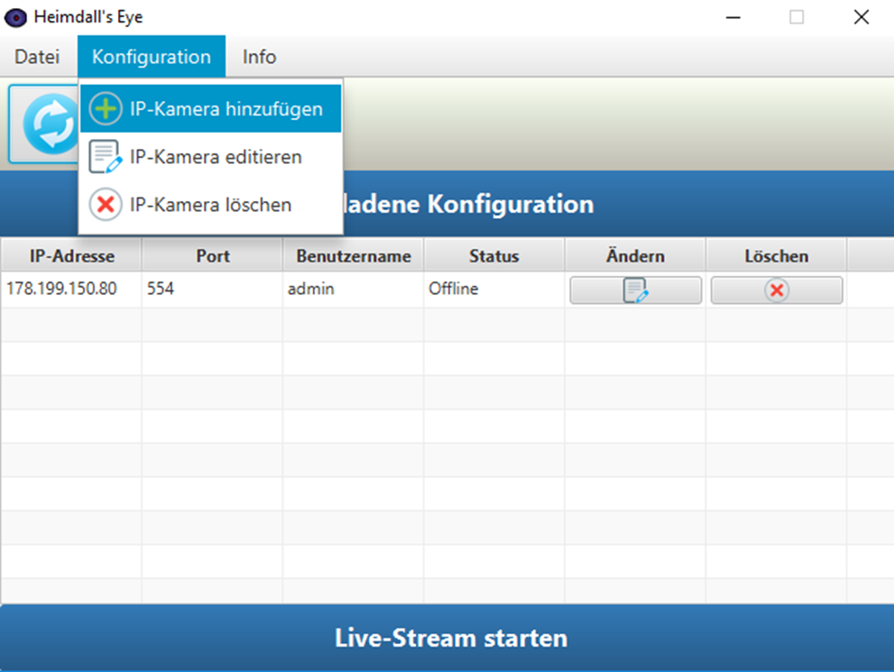
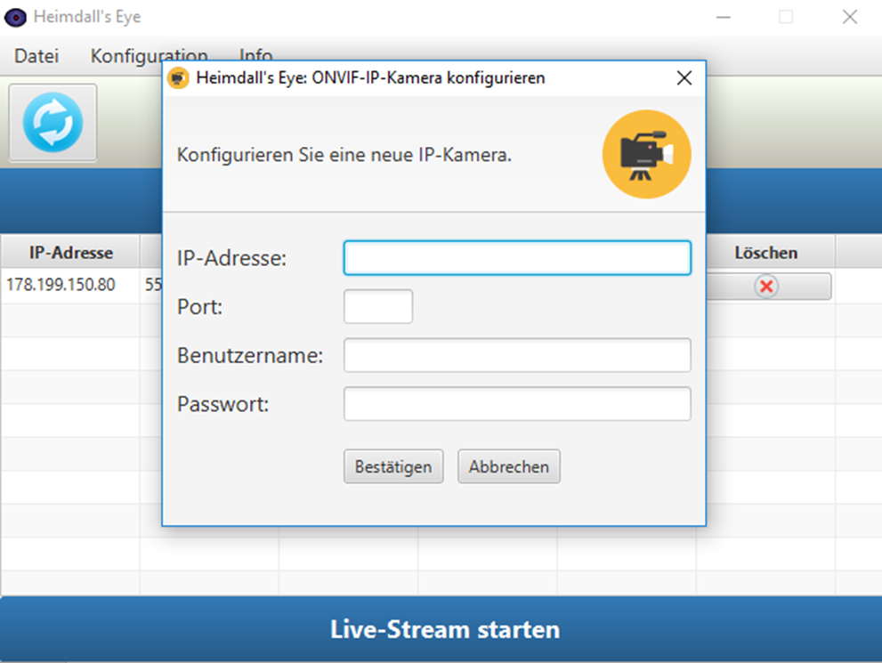
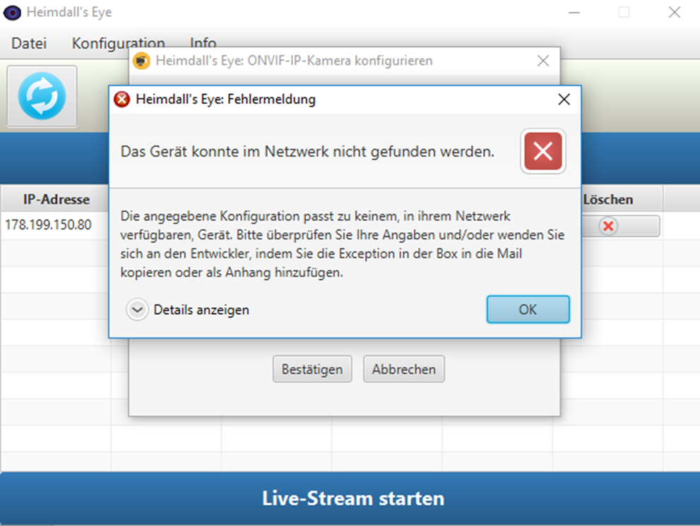
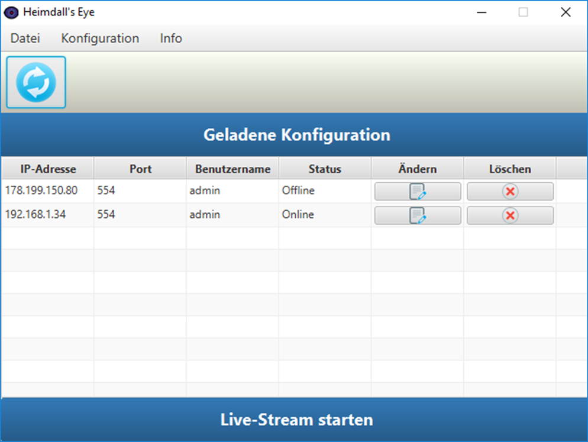
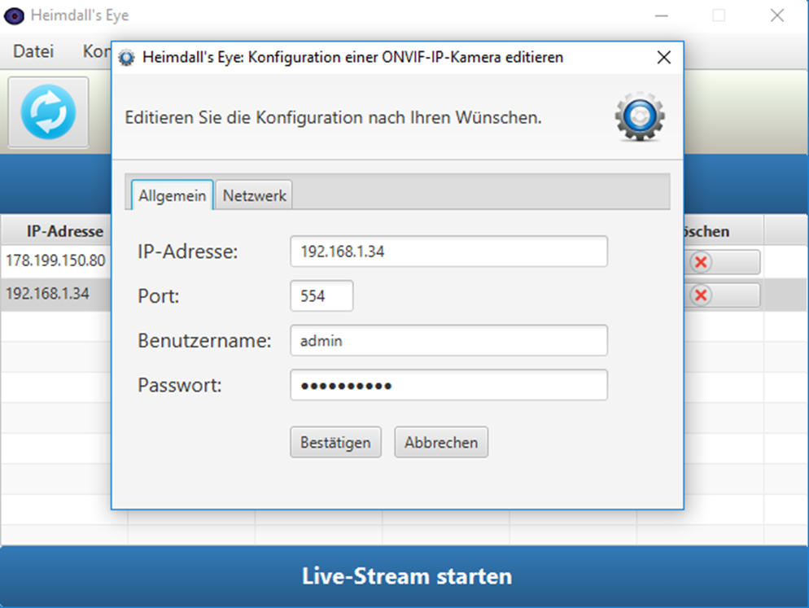
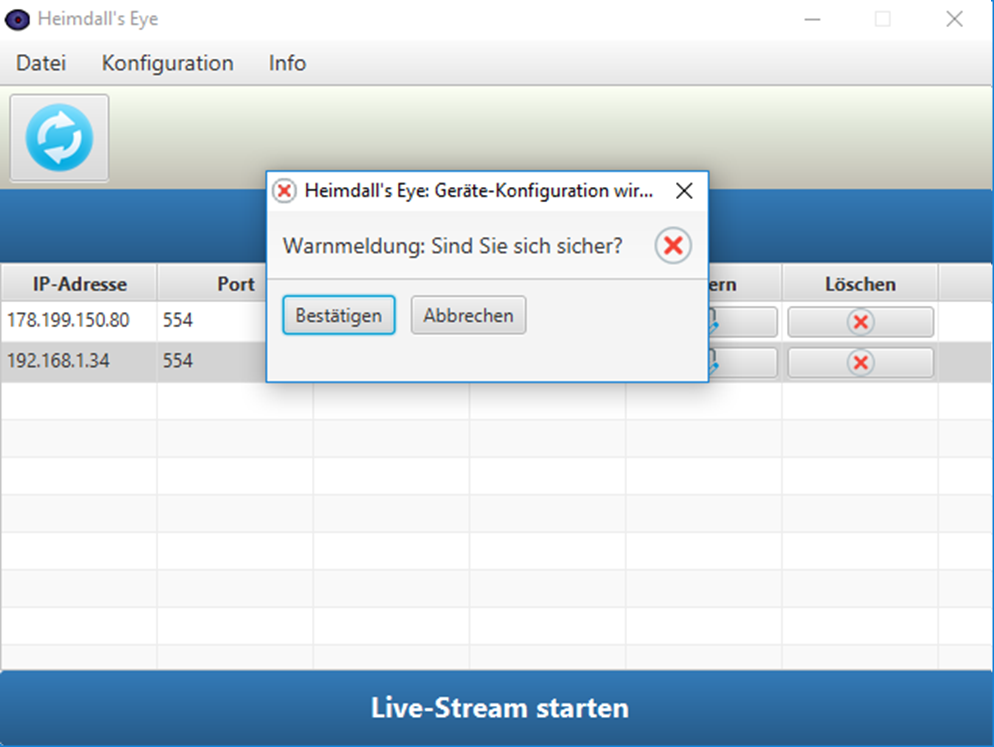
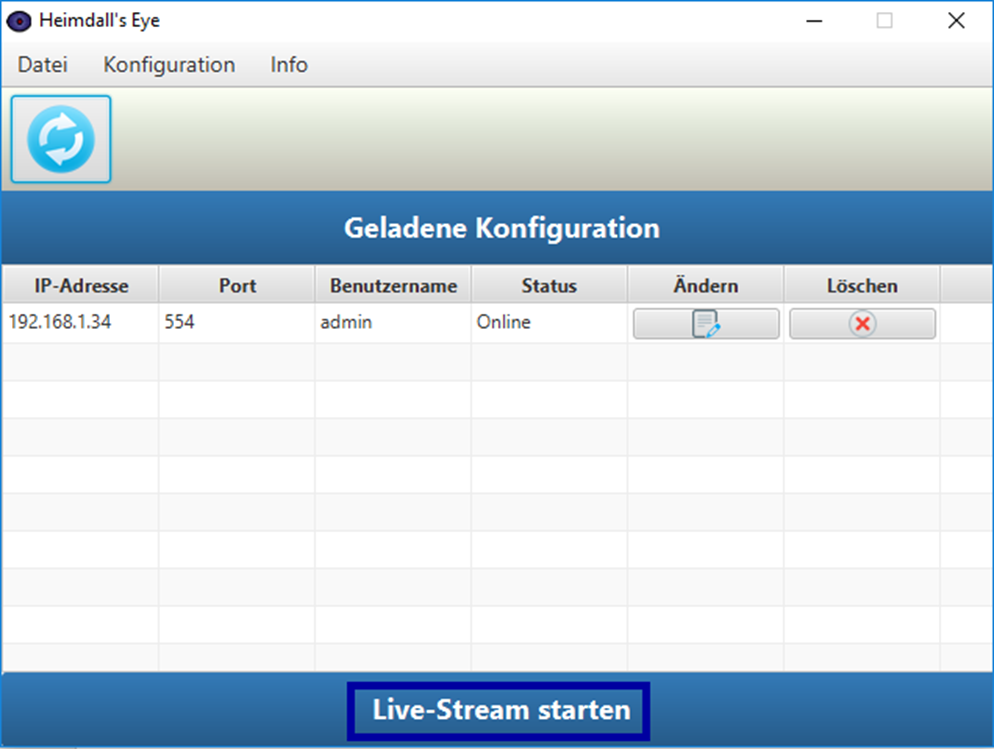
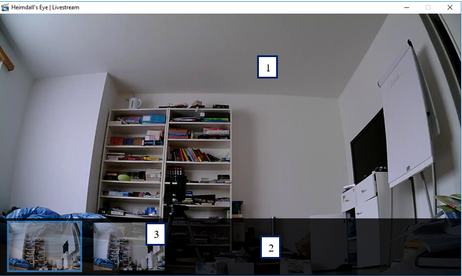

# Heimdalls-eye
Supports administration, adjustment and Livestreaming of PTZ-IP-Cameras that implement the ONVIF-Standard. 

* Heimdall's Eye follows the Model-View-Controller Architecture 
* The communication between the IP-Camera and the device running Heimdall's Eye is realized over the SOAP-Protocol.
* The format is hereby XML-based. 
* The configurations for the devices are persistently saved in an integrated Apache Derby Database.
* Heimdall's Eye doesn't use any external frameworks to realize the Object-Relational Mapping (ORM).
* The application makes use of the Unit-Of-Work-Pattern for all Database transactions.

I'll provide additional information regarding the architecture of the software in the future. 

## Overview
* [Technologies](#technologies)
* [Features](#features)
* [Current status](#current-status)

## Technologies 

* 
* 
* 
* 
* 
* 

## Features

### Start the software

Open the Heimdall's Eye folder and double-click on the heimdallseye.jar file. 

The software will start now. Depending on the number of configurations you have saved and the performance of your computer, this process can take up to a few minutes. 
You can lean back during this time or get yourself a coffee to relax. As soon as the loading window disappears, the program is ready.

### Configuration of an ONVIF-IP-Camera

In the menubar you can practically add a new device to your configuration by pressing the menu „Konfiguration“ -> „IP-Kamera hinzufügen“, like in the pircure below: 

As soon as you click on the menu the following window should appear:

Make sure that your IP-Camera is connected to your Intranet over an Ethernet-cable or WiFi before you continue. The IP-Adress of your camera is required to localize it within your network. If you don't know the IP-Adress of your device you can go to the configuration-panel of your router and list all devices that are currently connected to your network. Usually you can open the configuration-panel for your router by entering the adress of your router in your browser (**192.168.1.1** in most cases). Enter your user credentials and navigate to your devices, copy the adress of your camera and put it in the corresponding text-field.

Also add the logical port that your device uses - if you're not sure which one your camera uses, you'll find a list [here](https://www.ispyconnect.com/sources.aspx) with almost all avaiable IP-Cameras. Most of them use the **RTSP**-Protocol and therefore in nearly all cases the 554-Port.
The username and the password of your device should be listed somewhere in the instructions manual of your device. Also add them to the form and confirm your configuration with the «Bestätigen»-Button.

If the camera wasn't found in the network, you'll receive following error message:

If you are sure, that the IP-Camera is avaiable in the intranet and still receive this error-dialog, then please klick on the button «Details anzeigen», copy the content in the box and send it directly to me.

If the device was found, you'll see a new entry in the table:

You can see an new row in your configuation-table - congratulations!

### Editing a configuration of an ONVIF-IP-Camera

If you want to edit an existing configuration, you can click on the corresponding row in the table and then choose the button «editieren». Alternatively you can execute the same action over the menubar («Konfiguration» -> «IP-Kamera editieren»). 

**Important:** If you don't select a row and immediately click on the Edit-Button, you'll receive an error-message.

You should see the following window now:

You've the two tabs «Allgemein» and «Netzwerk» - under the first tab you can change your IP-Adress, if the device got a new one. You can also change the information regarding the port and the user credentials. Under the tab «Netzwerk» you've the option to set a new IP-Adress if the device is in a different network than your computer is in. You can add the exernal IP-Adress there. Make sure that you configured the Port Forwarding in your routers configuation if you want to make use of it. 

### Deleting the configuration of an ONVIF-IP-Camera

If you want to delete an existing configuration, you can select the corresponding row and click on the Löschen-Button. Alternatively you can execute the same action through the menubar («Konfiguration» -> «IP-Kamera löschen»).

**Important:** If you don't select a row and immediately click on the Delete-Button, you'll receive an error-dialog. Before the Delete is executed you'll have to confirm it a second time to avoid accidents:

### Start the Livestream

Make sure that at least one device is in your table, that is currently avaiable («online») before you continue, you'll get an error-message otherwise. 
Click on the button «Live-Stream starten» to initiate the Livestream. 

You'll have to wait a bit until the Livestream is initialized.

If you've congifured several devices this process can take up to 1-2 minutes. The Livestream has been successfully started, if this window here appears: 

The enumarations in the picture above show the contents the Livestream-Window consists of:
1. The active Livestream, which was selected over the thumbnail.
2. The thumbnail, which shows a mini-version of the stream of the other camera. The one with the blue border is the active one.
3. A preview of the Livestream of a device (<- Thumbnail)

The thumbnail fades out of the window, as soon as you leave the window with your cursor, since the showing of a thumbnail during the livestream usually bothers the user. It appears again, as soon as your cursor enters the Livestream-Window again. You can switch to other cameras in the thumbnail with the arrow-keys «right» and «left».

## Current status
Under construction. 

